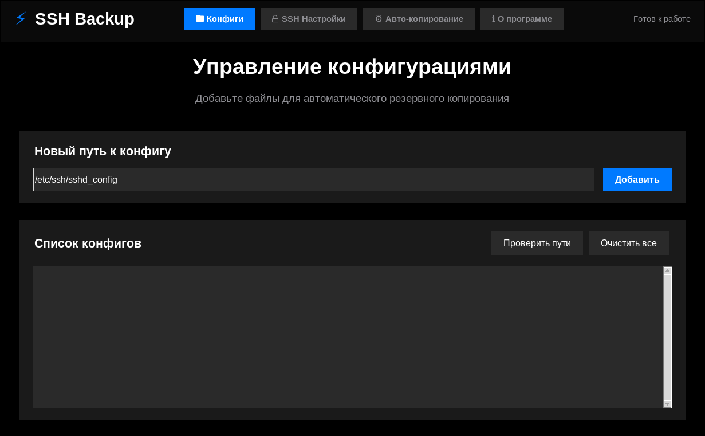
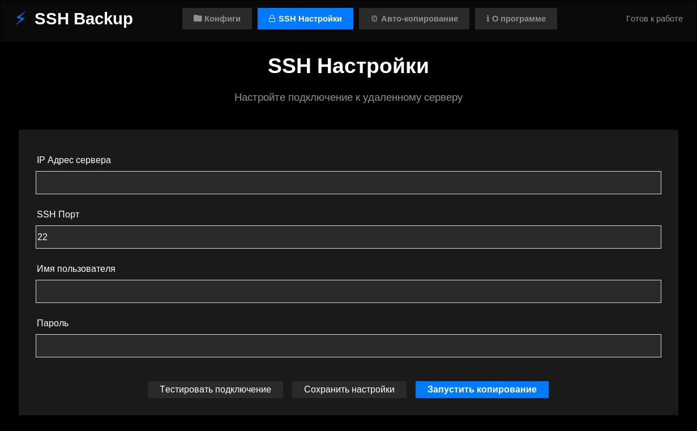
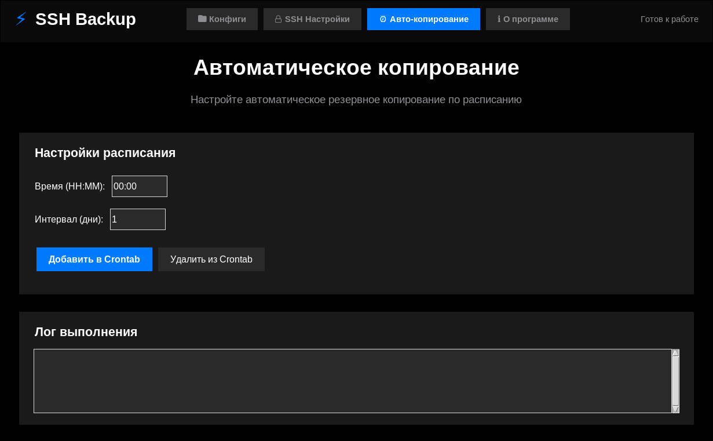

SSH Config Backup Tool ⚡

✨ Features

+ 🔒 Secure SSH connections with password support
+ 📁 Multi-protocol copying (SCP, SFTP, recursive)
+ ⏰ Automatic scheduling via crontab
+ 🔍 Remote file verification and accessibility checks
+ 📊 Detailed logging of all operations
+ 🚀 Easy configuration management
+ 🎯 Smart file type detection (files/directories)

## 📸 Screenshots

<h3>Application Interface</h3>

<table>
  <tr>
    <td align="center"><b>Config Management</b></td>
    <td align="center"><b>SSH Settings</b></td>
    <td align="center"><b>Auto Backup</b></td>
  </tr>
  <tr>
    <td></td>
    <td></td>
    <td></td>
  </tr>
  <tr>
    <td align="center">Manage configuration files</td>
    <td align="center">Configure SSH connections</td>
    <td align="center">Schedule automatic backups</td>
  </tr>
</table>

| Configuration Management | SSH Settings | Auto Backup |
|--------------------------|--------------|-------------|
|  |  |  |
